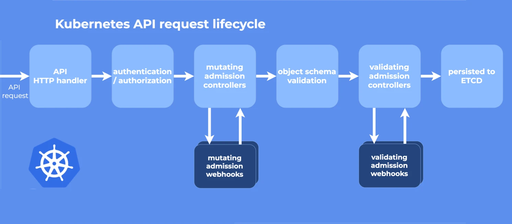

## 引言
在我们学习 KEDA 之前，我们需要简单了解一些关于HPA的知识。本文还将从 Demo 与源码入手，进一步了解 KEDA 的实现原理。

## 1. HPA 是如何扩缩容？

1. 从聚合API（metrics.k8s.io、custom.metrics.k8s.io或external.metrics.k8s.io）获取指标。

2. 从scaleTargetRef获取扩缩容的目标资源（例如：Deployment、StatefulSet等。这些资源都有一个名为scale的子资源，该接口允许你动态设置副本的数量并检查它们的当前状态）。 

3. kube-controller-manager根据扩缩容的目标的资源使用率的平均值或原始值计算出扩缩的目标值，进而确定目标副本数。

## 2. Metrics 如何获取？

- 对于资源指标，使用metrics.k8s.io API，通常由metrics-server提供。它可以作为集群插件启动。

- 对于自定义指标，使用custom.metrics.k8s.io API。它由其他度量指标方案厂商的“适配器（Adapter）”API服务器提供。

- 对于外部指标，使用external.metrics.k8s.io API。这可能也是由上述自定义指标适配器提供的。

## 3. KEDA 是什么

KEDA 提供了一套自定义资源定义（CRD），例如 ScaledObject。 安装 KEDA 时，它会创建 3 个 pod：

### keda-operator

keda-operator 根据声明的 ScaledObject 创建对应的HPA，并能激活HPA的部署（从0扩展到1）。[代码分析](../keda-operator-analysis)

> * 这里的“0 -> 1”指的是，如果当前副本数为0，但HPA定义的最小副本数不为0，则认为关闭了弹性伸缩能力，HPA将不再进行伸缩操作。 而 KEDA 实现了一种控制，一旦缩放到1后，伸缩操作将取决于HPA。

### keda-operator-metrics-apiserver

keda-operator-metrics-apiserver，实现了 external.metrics.k8s.io API ，为 HPA 获取 Kubernetes 集群外部的指标。 [代码分析](../keda-operator-metrics-apiserver-analysis)

> * 想要了解当前注册了哪些外部指标服务器，可以使用以下命令：
~~~
kubectl get APIService/v1beta1.external.metrics.k8s.io
~~~
> * 想要通过外部指标服务器获取外部指标，可以使用以下命令：
~~~
kubectl get scaledobject {scaledObjectName} -o jsonpath={.status.externalMetricNames}
kubectl get --raw /apis/external.metrics.k8s.io/v1beta1/namespaces/{namespaces}/{externalMetricNames}?labelSelector=scaledobject.keda.sh/name={scaledObjectName}
~~~

### keda-admission-webhooks

#### admission webhook 是什么?
在 Kubernetes apiserver 中包含两个特殊的准入控制器：MutatingAdmissionWebhook和ValidatingAdmissionWebhook。
这两个控制器将发送准入请求到外部的 HTTP 回调服务并接收一个准入响应。如果启用了这两个准入控制器，Kubernetes 管理员可以在集群中创建和配置一个 admission webhook。

validating webhooks 可以拒绝请求，但是它们却不能修改在准入请求中获取的对象，而 mutating webhooks 可以在返回准入响应之前通过创建补丁来修改对象，
如果 webhook 拒绝了一个请求，则会向最终用户返回错误。

KEDA 为ScaledObject，TriggerAuthentication，ClusterTriggerAuthentication 添加了Webhook。 详见：[验证规则](https://keda.sh/docs/2.14/concepts/admission-webhooks/)。

~~~go
func setupWebhook(mgr manager.Manager) {
	// setup webhooks
	if err := (&kedav1alpha1.ScaledObject{}).SetupWebhookWithManager(mgr); err != nil {
		setupLog.Error(err, "unable to create webhook", "webhook", "ScaledObject")
		os.Exit(1)
	}
	if err := (&kedav1alpha1.TriggerAuthentication{}).SetupWebhookWithManager(mgr); err != nil {
		setupLog.Error(err, "unable to create webhook", "webhook", "TriggerAuthentication")
		os.Exit(1)
	}
	if err := (&kedav1alpha1.ClusterTriggerAuthentication{}).SetupWebhookWithManager(mgr); err != nil {
		setupLog.Error(err, "unable to create webhook", "webhook", "ClusterTriggerAuthentication")
		os.Exit(1)
	}
}
~~~

## 4. Demo

- [External Scalers](../keda-external-scaler-demo)

- [Redis Scalers](../keda-redis-scaler-demo)

- [Mysql Scalers](../keda-mysql-scaler-demo)
