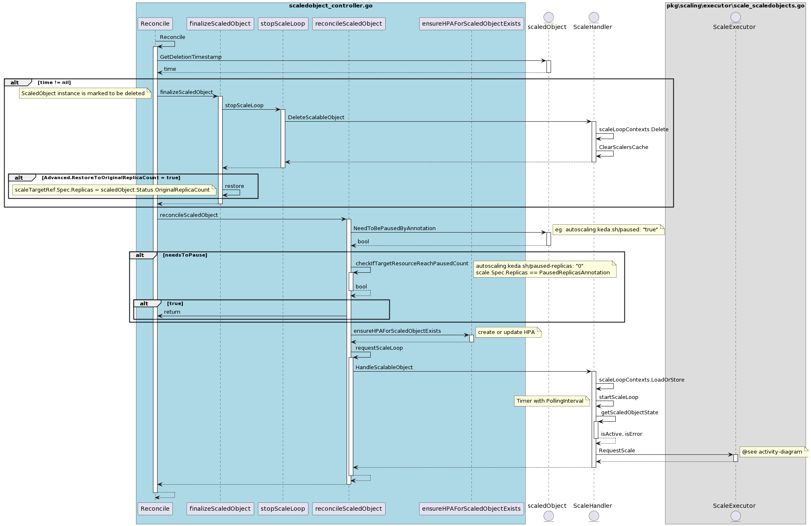
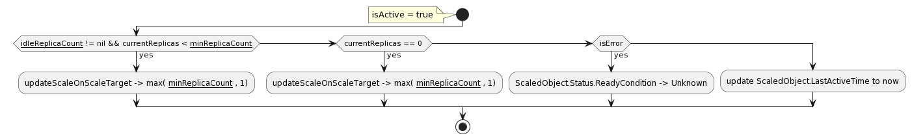
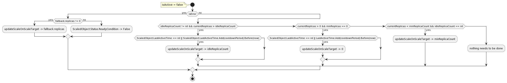

## 代码结构

~~~
├── ....
├── cmd // 入口
    ├── adapter   // keda-operator-metrics-apiserver
    ├── operator  // keda-operator
    ├── webhooks
├── pkg   // 组件代码实现
├── ....
~~~

## 解析

KEDA 项目使用 kubebuilder SDK 完成 ScaledObject 的 Operator 编写。

组件的启动入口位于 main.go 文件（路径：cmd/operator/main.go），通过 controller-runtime 组件启动 ScaledObjectReconciler。

ScaledObjectReconciler 是由 kubebuilder 生成的代码，因此我们主要关注的是 ScaledObjectReconciler 类的 Reconcile
方法（文件路径：controllers/keda/scaledobject_controller.go）。

在阅读 Reconcile 方法的代码时，我们可以思考以下问题以帮助理解执行流程：`Scaled Object 配置项的作用是什么？`,
以下配置说明可以结合时序图来理解：

1. 当 ScaledObject 对象被删除时，如果 `ScaledObject.spec.advanced.restoreToOriginalReplicaCount` 设置为
   true，则 `scaleTargetRef.Spec.Replicas` 将被设置为 Replicas 子对象声明的 replicas 。

2. 当 ScaledObject 对象具有注解 `autoscaling.keda.sh/paused: "true"` 时，将暂停自动缩放。
   如果当前的副本数不等于 `autoscaling.keda.sh/paused-replicas` 所声明的数量，则触发缩放逻辑，使当前副本数等于暂停时的副本数。

3. ensureHPAForScaledObjectExists 方法根据配置的 ScaledObject 对象创建 HPA 资源。

~~~go
	hpa := &autoscalingv2.HorizontalPodAutoscaler{
		Spec: autoscalingv2.HorizontalPodAutoscalerSpec{
     // 如果 ScaledObject 对象有 paused 的注解，
     // 则 minReplicas 和 maxReplicas 将等于 paused-replicas。
			MinReplicas: minReplicas,
			MaxReplicas: maxReplicas,
			// scaledObjectMetricSpecs 是通过 getScaledObjectMetricSpecs 方法获取。
			// 获取的时候会区分External metrics和Resource metrics，
			// 因为 CPU/Memory scaler 是通过 resource metrics 来获取的。
			Metrics:     scaledObjectMetricSpecs,
			Behavior:    behavior,
			ScaleTargetRef: autoscalingv2.CrossVersionObjectReference{
				Name:       scaledObject.Spec.ScaleTargetRef.Name,
				Kind:       gvkr.Kind,
				APIVersion: gvkr.GroupVersion().String(),
			}},
		ObjectMeta: metav1.ObjectMeta{
			Name:        getHPAName(scaledObject),
			Namespace:   scaledObject.Namespace,
			Labels:      labels,
			Annotations: scaledObject.Annotations,
		},
		TypeMeta: metav1.TypeMeta{
			APIVersion: "v2",
		},
	}
~~~

4. requestScaleLoop 方法用于循环检查 Scaler 中的 IsActive 状态，并根据状态进行相应的处理。（详细流程见下面的
   Active/Inactive 活动图）

- isActive = true

> if `currentReplicas < minReplicas` : `updateScaleOnScaleTarget -> max(minReplicaCount, 1)`
>
> if `currentReplicas == 0` : `updateScaleOnScaleTarget -> max(minReplicaCount, 1)`
>
> if `isError = true` : `ScaledObject.Status.ReadyCondition -> Unknown`

- isActive = false

> **isError = true**
>
> if `fallback.replicas != 0` : `updateScaleOnScaleTarget -> fallback.replicas`
>
> else ：`ScaledObject.Status.ReadyCondition -> False`
> 
> **isError = false**
>
> if `idleReplicaCount != nil && currentReplicas > idleReplicaCount && ScaledObject.LastActiveTime.Add(cooldownPeriod)
> .Before(now)` : `updateScaleOnScaleTarget -> idleReplicaCount`
>
> if `currentReplicas > 0 && minReplicas == 0 && ScaledObject.LastActiveTime.Add(cooldownPeriod).Before(now)` : `updateScaleOnScaleTarget -> 0`
>
> if `currentReplicas < minReplicaCount && idleReplicaCount == nil` : `updateScaleOnScaleTarget -> minReplicaCount`

总结：
当 IsActive 为 true 时，如果 ScaleTarget 的副本数为 0，则至少将其扩展至 1。
当 IsActive 为 false 时，如果发生错误，则将副本数缩放至 fallback.replicas。
如果没有错误，则优先使用 idleReplicaCount，如果不可用，则使用 minReplicas 进行缩放。
缩放过程受到上次活跃时间至冷却期（cooldownPeriod）等待时间的影响。

## 时序图

## Active 活动图

## InActive 活动图

