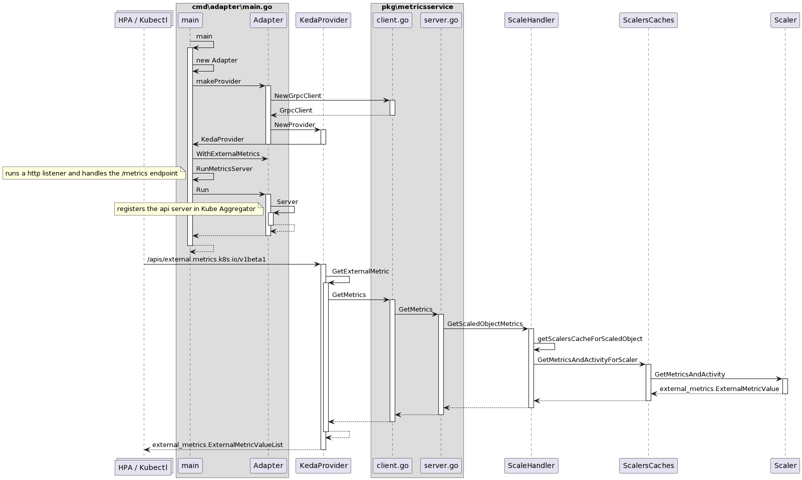

## 概念

先了解下如何通过 Kubernetes API Server 暴露的 HTTP API 找到对应的资源信息。举个例子，想要通过 API 接口查命名空间 keda 下的 Deployment：

> kubectl get --raw /apis/apps/v1/namespaces/keda/deployments

其中，apps为group，v1是version，deployments是resource。

概念就出来了：
~~~
GV & GVK & GVR
GV：group & version
GVK：group & version & kind
GVR：group & version & resource
~~~
资源（resourse）总是从属于某个API组（group）的某个版本（version），也就称为GVR，同样，类型（kind）也从属于某个API组（group）的某个版本（version），称为GVK。根据GVK，k8s就能找到对应的资源类型，根据GVR，就能够找到对应的资源信息，于是，GVK/GVR也就成了k8s资源的坐标。

简单来讲，编写 yaml 过程中，我们会写 apiversion 和 kind，其实就是 GVK；而与 Kubernetes API Server 通信是 http 形式，就是将请求发送到某个 http path，这个 http path 其实就是 GVR。

#### * 如何查找Kubernetes API Server 暴露的 HTTP API
通过下面的命令获取集群支持的所有 API 版本，输出结果是以group/version的方式呈现的。
> kubectl api-versions

获取特定的group/version下的resource
> kubectl api-resources --api-group {GroupName} -o wide

## 代码结构
~~~
├── ....
├── cmd // 入口
    ├── adapter   // keda-operator-metrics-apiserver
    ├── operator  // keda-operator
    ├── webhooks
├── pkg   // 组件代码实现
├── ....
~~~

## 解析

Kubectl 可以通过下面的 API ，获取到对应的指标。

~~~
/apis/external.metrics.k8s.io/v1beta1/namespaces/{namespaces}/{externalMetricNames}?labelSelector=scaledobject.keda.sh/name={scaledObjectName}
~~~

同理，HPA 也是通过该 PATH 来获取。

* 查看 keda-operator-metrics-apiserver 的日志，通过 userAgent 可以看出 Kubectl 与 HPA 的请求。
~~~log
"HTTP" verb="LIST" URI="/apis/external.metrics.k8s.io/v1beta1/namespaces/default/s0-redis-mylist?labelSelector=scaledobject.keda.sh%2Fname%3Dtest-so-3" latency="7.408728ms" userAgent="kubectl/v1.28.5+k3s1 (linux/amd64) kubernetes/5b2d127" audit-ID="d6711361-45ea-4ea2-9bc5-2b417b424d44" srcIP="10.42.0.1:46152" resp=200
"HTTP" verb="LIST" URI="/apis/external.metrics.k8s.io/v1beta1/namespaces/default/s0-redis-mylist?labelSelector=scaledobject.keda.sh%2Fname%3Dtest-so-3" latency="12.145371ms" userAgent="k3s/v1.28.5+k3s1 (linux/amd64) kubernetes/5b2d127/system:serviceaccount:kube-system:horizontal-pod-autoscaler" audit-ID="66f37fc6-3683-4d36-89c5-be8758cd154a" srcIP="10.42.0.1:46152" resp=200
~~~

该 HTTP API PATCH 最终由 ScaleHandler 的 GetScaledObjectMetrics 方法处理，所以我们先跳过 Kube Aggregator 转发的流程， 主要关注 ScaleHandler 的 GetScaledObjectMetrics 方法。

该方法通过指定的 namespaces 和 ScaledObject 名称找到 ScalersCache 。ScalersCache 主要包含 ScaledObject 和 ScaledObject指定的 Scaler。指标由实际指定的 Scaler 对象的 GetMetricsAndActivity 方法返回。

详细流程看下图:

## 流程图

