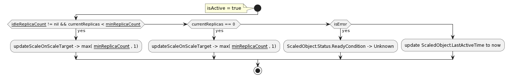

## 代码结构
~~~
├── ....
├── cmd // 入口
    ├── adapter   // keda-operator-metrics-apiserver
    ├── operator  // keda-operator
    ├── webhooks
├── pkg   // 组件代码实现
├── ....
~~~

## 解析

KEDA 项目是用 kubebuilder SDK来完成 ScaledObject 的 Operator 编写。

组件启动入口在于main.go （cmd\operator\main.go）文件中： 通过 controller-runtime 组件启动 ScaledObjectReconciler。 

ScaledObjectReconciler 是由 kubebuilder 生成的代码， 所以我们主要关注 ScaledObjectReconciler（controllers\keda\scaledobject_controller.go） 的 Reconcile 方法。

我们可以带着 `Scaled Object 配置项的作用是什么？` 这个问题来阅读这个方法的代码，方便我们理解方法执行流程，下列配置说明可以结合时序图理解。

1. ScaledObject 对象被删除的时。 当 `ScaledObject.spec.advanced.restoreToOriginalReplicaCount = true` 的时候，`scaleTargetRef.Spec.Replicas` 会被设置为 Replicas 子对象声明的 replicas 数量。

2. ScaledObject 对象有 `autoscaling.keda.sh/paused: "true"` 这个 annotations 的时候，会暂停自动缩放。 scaledobject 处于暂停状态，
如果当前的 replicas 数量不等于 `autoscaling.keda.sh/paused-replicas` 数，则触发缩放逻辑，让当前副本书等于暂停副本数。

3. 

## 时序图

## Active 活动图

## InActive 活动图

## KEDA Scaled Object 的配置项的作用是什么
