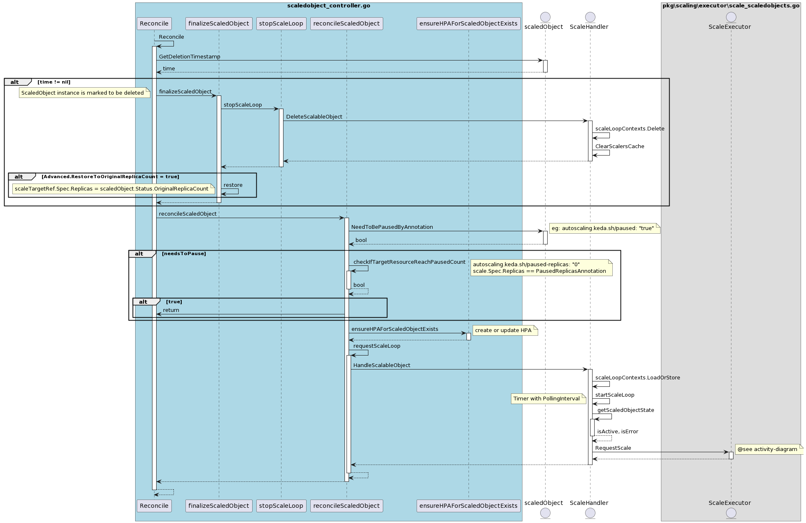
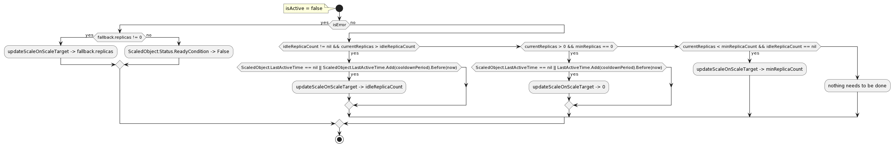

# KEDA Scaled Object配置是如何使用的?

项目用kubebuilder SDK来完成ScaledObject的Operator编写。

主要关注 controllers\keda\scaledobject_controller.go ScaledObjectReconciler 的 Reconcile 方法。

## 时序图

## Active 活动图

## InActive 活动图

